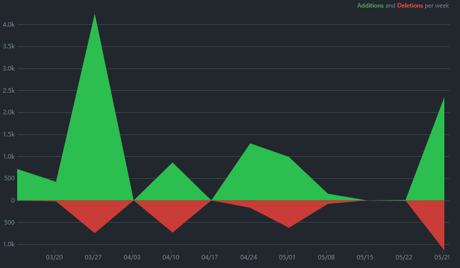
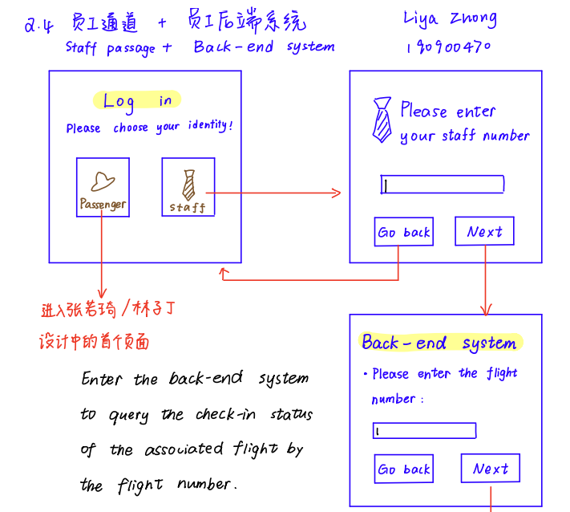
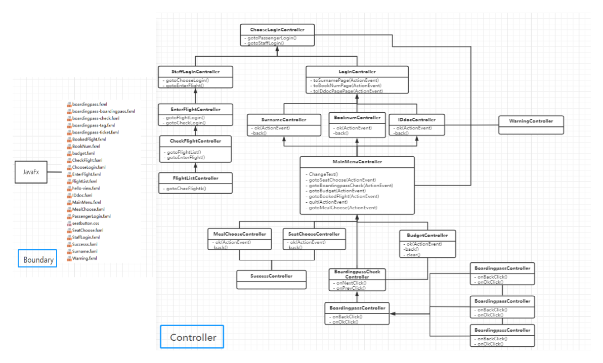
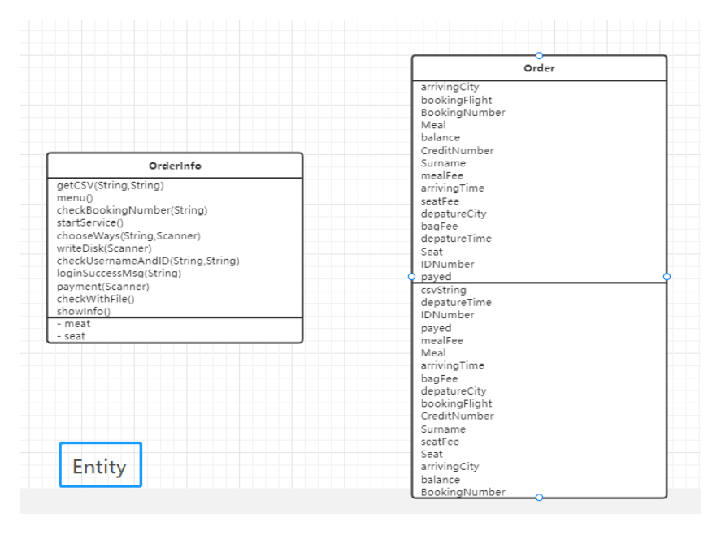
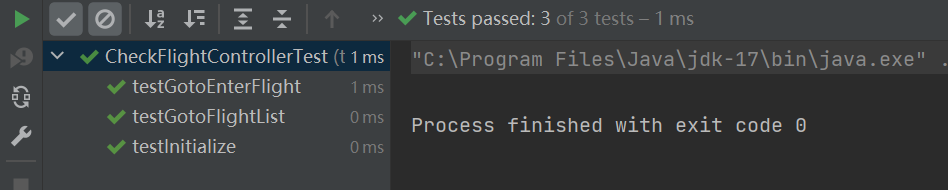
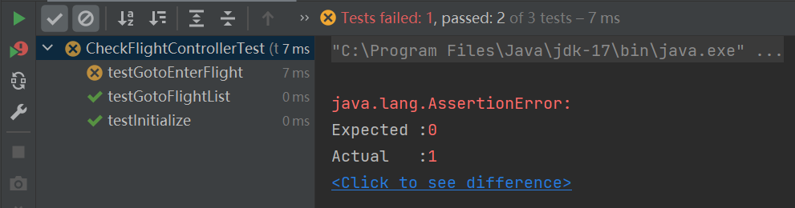

<!-- 让表格居中显示的风格 -->

# Software Engineering Group Project Final Report

  
Group 16

[toc]

| Name         | BUPTNumber | QMNumber  |
|:-------------|:----------:|:---------:|
| Xiaoyi Liang | 2019213029 | 190898395 |
| Ruoqi Zhang  | 2019213236 | 190900311 |
| Ruibo Gang   | 2019213129 | 190897756 |
| Zhishang Yu  | 2018212708 | 190015671 |
| Ziding Lin   | 2019213116 | 190898421 |
| Liya Zhong   | 2019213243 | 190900470 |

## 1. Introduction
The aim of this project is to develop a smart kiosks in front of its check-in desks at the London Heathrow Airport. The system is developed with Agile methods. To develop this system, we first have meetings to brainstorm for specific requirements. Then we use some fact-finding techniques such as interviews, observation, questionnaire and so on to make the requirements clear and accurate enough. Then we write java code through iterative development. At the end, we improve the user interface and produce some documents like user manuals. We hope every user of this software and our customer can be satisfied with this software.

## 2. Project management
### 2.1 Project Planning
This project adopts agile development method and agile project management process.Our development work is carried out according the recommendations in [Handout](https://qmplus.qmul.ac.uk/pluginfile.php/2604460/mod_resource/content/3/EBU6304_GroupProjectHandout_2022.pdf)
There maybe a little error of a few days when truly implement each iteration.Before beginning of each iteration, we took a group meeting to review the dependency analysis and theactivity network in project planning step to double check the dependencies between each task which is vitalin making a schedule. And you could get our meeting minutesin detail from our [QMplus hub Journals](https://hub.qmplus.qmul.ac.uk/artefact/blog/index.php?group=3633)
In this project, we used [JavaFX](https://openjfx.io/) to complete the GUI design, [Maven](https://maven.apache.org/) to manage the project and related packages, and [Github](https://github.com/SE-of-nobody/SmartFlightCheckInKiosk) to complete the team collaboration, version control and contribution statistics of the code.

| Date             |                                                     Task                                                     |
|:-----------------|:------------------------------------------------------------------------------------------------------------:|
| 11-15 March      |                         Set up the QMPlus Hub group and discuss the project handout.                         |
| 16-18 March      |                       Story writing workshop. Outcomes: product backlog and prototype                        |
| 21 March-1 April |                Iteration 1 Complete most basic logic and functionality in the back-end design                |
| 4-15 April       |                                 Iteration 2 Complete most of the GUI design                                  |
| 18-29 April      |             Iteration 3 Complete building controllers that connect the different stage together              |
| 2-13 May         | Iteration 4 Complete the docking work of Boradingpass part and supplement the logical code of the staff part |
| 16-30 May        |                             Iteration 5 Complete appearance design and bug fixes                             |

It is easy to see that a significant periodicity in our submissions from [Github's](https://github.com/SE-of-nobody/SmartFlightCheckInKiosk) code frequency

### 2.2 Managing people
In terms of people management, we divide the work according to the interest of
different students. We use the way of team competition to motivate the members, and
the students who finish the task the fastest will be rewarded. We adhere to the principles
of consistency, respect, inclusion and honesty for team members.

| Subgroup |                                     Members |                                                            Task                                                             |
|:---------|--------------------------------------------:|:---------------------------------------------------------------------------------------------------------------------------:|
| Group1   | Xiaoyi Liang Ruibo Gang Ruoqi Zhang |     In part Passenger, complete GUI design, code writing page and iteration, which including jump of the page and alert     |
| Group2   |                                  Liya Zhong |                            In part Staff, complete GUI design, code writing page and iteration.                             |
| Group3   |                                  Ziding Lin | In part Passenger, complete writing and iterating back-end code, which including login, transfer parameters and junit test. |
| Group4   |                                 Zhishang Yu |   In part Staff, complete writing and iterating back-end code, which including login, transfer parameters and junit test.   |

Otherwise, we use [Github](https://github.com/SE-of-nobody/SmartFlightCheckInKiosk)   recording everyone's commit.Of course, we also made a submission on QMhub

| Name         | Addition | Deletion |
|:-------------|---------:|:--------:|
| Xiaoyi Liang |     2753 |   1773   |
| Ziding Lin   |     3323 |    91    |
| Ruoqi Zhang  |      693 |    38    |
| Ruibo Gang   |      391 |    58    |
| Liya Zhong   |      884 |   414    |
| Zhishang Yu  |      632 |    0     |

 Pay attention:  

It is just the contribution from Mar 13, 2022 to May 8, 2022. Contribution in [Github](https://github.com/SE-of-nobody/SmartFlightCheckInKiosk) has a delay in counting submissions from the last two weeks, which means The data in the table is for reference only.

### 2.3 Risk Management
In this project, we may encounter project risks and product risks. For the project risks, the approach we took was to give the team members enough time. If one person can't get things done on time, others have plenty of time to take over and get things done. Therefore, our schedule is slightly different from the recommended schedule. For the product risks, we take the approach of multiple iterations + multiple evaluations. At the end of each iteration, we would discuss the shortcomings of this iteration in the Wechat and evaluate our design and implementation. Once a problem is identified, it will be improved in the next iteration. If a serious problem is found during the iteration, we do not change the plan in the middle of the iteration, but choose to fix the problem in the next iteration. In fact, we did encounter a serious problem and solved it using this method. Please see our weekly journals for details.

## 3. Requirements
### 3.1 Apply the requirements finding techniques
In this project, we used [JavaFX](https://openjfx.io/) to complete the GUI design, [Maven](https://maven.apache.org/) to manage the project and related packages, and [Github](https://github.com/SE-of-nobody/SmartFlightCheckInKiosk) to complete the team collaboration, version control and contribution statistics of the code.
### 3.2 User stories
In terms of user stories, we produce a large number of user stories, delete a batch through meetings, and then evaluate and priorities the remaining parts.
We chose a different ID for each story.  According to the Specification in Handout, we chose different three-digit numbers.  Where the leading number indicates which part they belong to:

| ID  |      Category      |
|:----|:------------------:|
| 1   |      Check-in      |
| 2   |   Extra options    |
| 3   |   Boarding pass    |
| 4   |  Passengers list   |
| 5   | Other requirements |

Different second digits indicate that they belong to different problems, and the third digit represents different details of the same problem.

| Story ID |                    Story Name |                                                                            Description                                                                             | Iteration version number |
|:---------|------------------------------:|:------------------------------------------------------------------------------------------------------------------------------------------------------------------:|:------------------------:|
| 111      |                    check in 1 |                                                                information by input booking number                                                                 |            1             |
| 112      |                    check in 2 |                                         passengers can get their flight booking information by input surname and ID number                                         |            1             |
| 113      |                    check in 3 |                                          passengers can get their flight booking information by scanning the ID document                                           |            1             |
| 114      |                    check in 4 |                                            passengers can get their flight booking information by input booking number                                             |            3             |
| 121      |                flight summary |                                                   system will show the summary of the flight booking information                                                   |            1             |
| 131      |                 choose seat 1 |                                                         passengers can choose the seat through the screen                                                          |            1             |
| 132      |                 choose seat 2 |                                                                      the seat has been chosen                                                                      |            1             |
| 133      |                   choose meal |                                                                   passengers can choose the meal                                                                   |            1             |
| 134      |                       confirm |                                                            passengers scan the ID document and confirm                                                             |            1             |
| 211      |               Extra options 1 |                                                   choose special seating（ seat with extra legroom，gourmet menu）                                                    |            1             |
| 212      |               Extra options 2 |                                                  ·Payment interface（ enter the details of customer's credit card)                                                  |            2             |
| 213      |               Extra options 3 |                                                        ·final confirmation screen(information confirmation）                                                        |            1             |
| 221      |                Payment method |                                                                     ·Multiple payment methods                                                                      |            3             |
| 231      | Operation interface interface |                                                                         ·Visual seat style                                                                         |            1             |
| 241      |         Service Customization |                                                                  ·Service types can be customized                                                                  |            1             |
| 311      |               Boarding pass 1 |                                            Passenger wants to get her/his boarding pass so she/he can get on the plane                                             |            1             |
| 321      |                    Check-in 1 |                                             Passenger wants to know where should she/he drop her/his check-in packages                                             |            2             |
| 322      |                    Check-in 2 |                  passenger wants to change the number of the checkin packages because she/he hadn't count them correctly when booking the tickets                  |            3             |
| 411      |             Confirm the query | Airport staff want to query the flight number to see the detailed flight information (such as the starting place and time) to confirm the query object is correct. |            1             |
| 421      |     Check-in status display 1 |                                            Airport staff can check the information of the passengers on a given flight.                                            |            1             |
| 422      |     Check-in status display 2 |                           Airport staff can check the check-in status which is updated in real time of the passengers on a given flight.                           |            1             |
| 423      |     Check-in status display 3 |                  Airport staff can easily check the overall check-in status and the number of passengers who have not checked in for that flight.                  |            3             |

### 3.3 Iterations planning
We plan our iterations according to the suggested Timeline in handout. There is error of a few days when truly implement each iteration.

| Date             |                                                     Task                                                     |
|:-----------------|:------------------------------------------------------------------------------------------------------------:|
| 21 March-1 April |                Iteration 1 Complete most basic logic and functionality in the back-end design                |
| 4-15 April       |                                 Iteration 2 Complete most of the GUI design                                  |
| 18-29 April      |             Iteration 3 Complete building controllers that connect the different stage together              |
| 2-13 May         | Iteration 4 Complete the docking work of Boradingpass part and supplement the logical code of the staff part |
| 16-30 May        |                             Iteration 5 Complete appearance design and bug fixes                             |

### 3.4 Prototype
Depending on each person's job assignment, we will design the relevant GUI ourselves. Most of Prototype's designs were hand-drawn, which made our designs easier and more creative.

    
     
    
Some screenshots of Prototype

As development progressed, our requirements changed, so the prototype was modified or redone many times. With these prototypes, developers can feel comfortable knowing what the software should be designed to look like. Interactive prototypes allow developers to understand the logical structure of the user interface. Moreover, these prototypes contain art materials and color schemes. This makes our software more beautiful.

### 3.5 Adapt to changes
During the procedure of our project, there are plenty of changes in our initial iteration plan. For example, in the initial brainstorming we only discussed the implementation of the individual feature pages. When we linked the pages together, we realized that there were too many unnecessary page jumps, so we redesigned the main menu.
In addition, when designing the function of page jump, we also encountered a lot of difficulties, so we designed different schemes.  In the end, we adopted Ruibo Gang's solution to ensure smooth parameter transfer.
We have a routine meeting every week held by our team leader. During the conference, everyone put forward their opinions toward the current project, for instance, problems meet when implement with code and possible adjust to the requirement analysis. Then, the meeting recorder will log all these confusions and we will have a fierce discussion to them. As a result, we may change in our product backlog and user stories after the meeting.  

## 4. Analysis and Design

### 4.1 Class Diagram and Analysis

This is the UML diagram that demonstrates the class relationship in our project.

We use JavaFX to do GUI development, each fxml file corresponds to a controller for control, first the project's entry App.java calls ChooseLogin's fxml and controller, this controller can lead to the controller of passengers and employees

The entity class "Order" is the class in which all the operations on a table in data.csv are written. It has Constructors and properties for the parameters "booking number, id number surname, meal, credit number, balance, seat, luggage fee, whether is paid, meal fee, seat fee, flight number" of the passenger information. It is open to extensions and closed to modifications.

### 4.2 Reusability

The reusability during our system is high because we make full use of the JumpTo, Warning, Mainmenu classes to achieve a variety of jump functions between modules and within modules and sent warning.  And Csvreader and Csvwrite classes is used in the whole program for data entry and reading.

Instead copy and past the codes to different parts, contributing to the high reusability of our codes. 

This significantly reduced our workload since we don’t need to change many times if one part needs to be changed for bugs or changes.

### 4.3 Design Principle

1. Single Responsibility Principle (SRP)

   Each class in our system fulfills the single responsibility principle. Since we use JavaFX to design the system, our java classes are all distinguished by modules and services. GUI is divdided into two parts, Controller and FXML document. Each control class is only responsible for one action and each FXML is related to only one controller.
2. Open-Closed Principle (OCP)

   Our software entity is open to extension and closed to modification, which means that a software entity should be changed by extension rather than by modifying existing code. The controller classes in our project conform to this principle because we just need to add the new extension to the original class without modifying it.
3. Don't Repeat Yourself (DRY)

   To avoid duplication, we always create a separate class to implement a function used frequently, such as the Jumpto class which is used by all the GUI controller to jump to other GUI. So if there is any change to this function, just modify the Jumpto class, for example.
### 4.4 Design Quality
Our program meet all the requirements and our application is well structured. Our structure is modular, and contains distinct representations of data, architecture, and components. And since we manage the project on Github and illustrate real-time progress on QMhub, the project is maintainable, traceable and well documented. After we finished the project, we spent a whole week removing redundancies, modifying the file structure, writing reports, and testing the project.
## 5. Implementation and Testing
### 5.1 Implementation
#### 5.1.1 Implementation Strategy
We have divided the back-end code into two parts: passenger and staff, which will be introduced to you in turn below. At the beginning of the code, we unified the variable name and function name in the code.  
We use object-oriented programming (Java language), which includes class definition and methods’ definition. 
We use different kinds of mapping, such as association (including one-to-one and one-to-many) and  inheritance.  

#### 5.1.2 Iteration Plan
You could see this part above in [3.3](#jump).
### 5.2 Testing
#### 5.2.1 Test Strategy
Our strategy is to divide the code into front-end and back-end parts, which are completed by 4 students and 2 students respectively.Our aim is to verify the results from the implementation stage by testing each software build. We test the software in both component level and integration level.   
At the beginning, we simulated the software usage scenarios and designed many different schemes and corresponding functional programs,including valid user inputs and invalid user inputs.   
Second, we identify and structure test procedures. We try to reuse existing test procedures and create generic test procedures. First, we change register part to register a new account. After that we this account to we check login, including correct and incorrect input check. Then we go to the home screen to check different sections (which is mapping to different functions).   
Finally, we find defects for the system.   

#### 5.2.2 Test techniques
We use black boxes test to test the software requirements and use white box test to test the internal program logic.
##### Black-box test:
For boundary and entity classes, we use the black-box test method. In addition, we use a large and extensive set of automated tests. Before we started coding, we compared many test frameworks and found out JUnit is the most suitable test framework for us to test the code since it has many advantages.  
Although we decided to use JUnit, group members had different ideas about which version to use. Some members prefer to use JUnit4 and the other prefer JUnit5. After comparing the difference of JUnit4 and JUnit5, combining the code we need to test, we ended up using JUnit4 to test our project.  

##### White-box test:
We use white-box test to test all statements and conditions. Here is one of the examples of our white-box test.   
Normal user login test: We use white-box test technology to test all the paths.   

#### 5.2.3 The Using of TDD
We use Test Driven Development to develop the entity and control part of our system. We write tests prior
to write the production code. Then we write codes, execute the test, make change of the codes and execute
the test again until pass all the tests.  
Here are examples about our code passing the test.  

    
     
    
Example of true input

 

    
     
    
Example of false input

## 6. Appendix
### Appendix-1 References
[1] [Github](https://github.com/SE-of-nobody/SmartFlightCheckInKiosk)  
[2] [Intro of Software Engineering by QMUL](https://qmplus.qmul.ac.uk/pluginfile.php/2574097/mod_resource/content/8/EBU6304_W1_Live_Introduction%20to%20Software%20Engineering_student.pdf)  
[3] [TDD by QMUL](https://qmplus.qmul.ac.uk/pluginfile.php/3179540/mod_resource/content/2/EBU6304_W6_Rec_TDD%20Demo%20-%20Mac%20Console%20Launcher.pdf)  
[4] [Development by QMUL](https://qmplus.qmul.ac.uk/pluginfile.php/3179536/mod_resource/content/3/EBU6304_W6_Rec_Test%20Driven%20Development.pdf)  
[5] [Implementation&Testing by QMUL](https://qmplus.qmul.ac.uk/pluginfile.php/2619548/mod_resource/content/3/EBU6304_W5_Rec_Implementation_Testing.pdf)  
[6] [Architecture by QMUL](https://qmplus.qmul.ac.uk/pluginfile.php/2611288/mod_resource/content/3/EBU6304_W4_Rec2_Software%20Architecture.pdf)  
[7] [Design by QMUL](https://qmplus.qmul.ac.uk/pluginfile.php/2586898/mod_resource/content/3/EBU6304_W4_Rec1_Design.pdf)  
[8] [Processes&Agile by QMUL](https://qmplus.qmul.ac.uk/pluginfile.php/2574104/mod_resource/content/6/EBU6304_W1_Rec_Processes_and_Agile.pdf)  
[9] [Handout](https://qmplus.qmul.ac.uk/pluginfile.php/2604460/mod_resource/content/3/EBU6304_GroupProjectHandout_2022.pdf)  
[10] [JavaFX](https://openjfx.io/)  
[11] [Maven](https://maven.apache.org/)  

### Appendix-2 Main Screenshots

 
 
 
 
 
 

 

 
 
 
 
 
 

